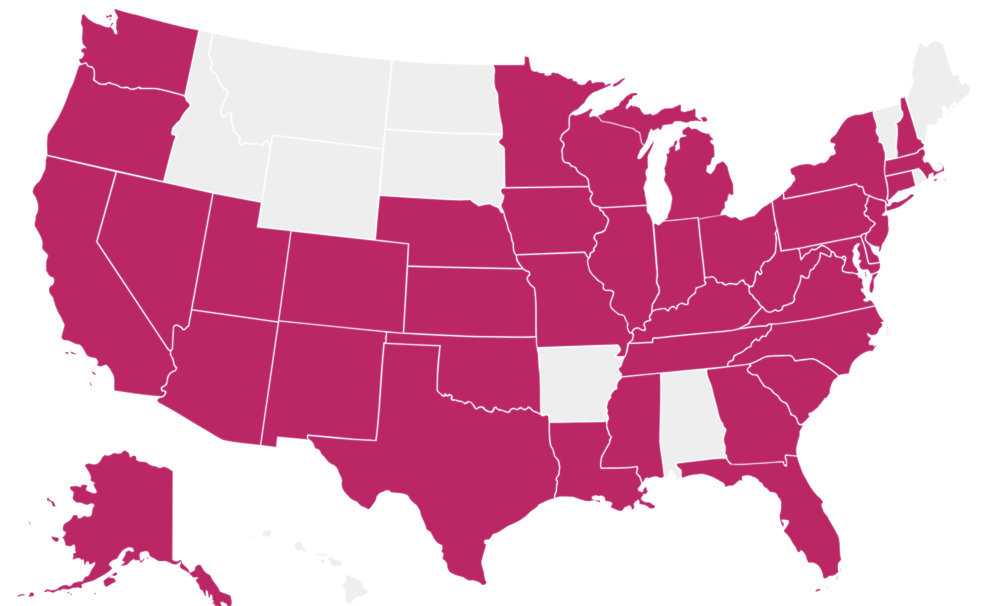

This is just a collection of additional links and pages that have to me and my corner of the internet.

## Collections

I have started to keep track of things that I have seen and/or done.  The one thing I regret not keeping track of is the concerts that I have been to over the years. Maybe someday I will go back and try to figure it all out. 

- **[/tv-series](../tv-series/)** List of almost all TV Series that I have watch from start to finish.
- **[Letterboxd](https://letterboxd.com/terrymooreii/films/)** Movies that have seen
- **[Discogs](https://discogs.com)** Vinyl record collection
- **[Untappd](https://untappd.com)** I love craft beer, mostly IPAs, and I been keeping track on Untappd.

## Projects

Most of my projects are on [Github](https://github.com/terrymooreii) but here are the more notable apps that I have written

- **BusterRadio Web** 
  - Frontend for Archive.orgs Live Music
  - Vue 2
  - TailwindsCSS
  - Firebase
- **BusterRadio App** 
  - React Native iOS app 
  - Expo
- **expo-playlist**
  - The swift / React native module for managing a list of music tracks with gapless playback
- **White Whale Boards** 
  - A web app for home brewers to keep track of the beer they have on tap. Complete with a chalkboard like interface to display on a TV or monitor. Also able to use a Raspberry PI with a flowmeter to calculate the beer left in the kegs.
  - Stencil.js
  - TailwindsCSS
  - Raspberry PI
  - Firebase
- **Group Contact List** 
  - Just a simple contact list app used by my mom rather large family.  
  - Vue 2
  - Firebase
- **Stanley Cup Bracket**
  - The longest running app used each year for my families Stanley Cup playoff betting
  - PHP
  - MySQL
- **Sia** 
  - Static Site Generator currently used for this blog
  - Nodejs
  - Nunjuks templates
- **Garage Door Pi** 
  - A way to monitor and open/close my garage from a Raspberry Pi.
  - Node
- **Many more small projects and libraries**

## [States](https://m.maploco.com/visited-states/mine.php?states=AK-AZ-CA-CO-CT-DC-DE-FL-GA-IA-IL-IN-KS-KY-LA-MA-MD-MI-MN-MO-MS-NC-NE-NH-NJ-NM-NV-NY-OH-OK-OR-PA-SC-TN-TX-UT-VA-WA-WI-WV&w=ml) I have been to

Just 10 left: Alabama, Arkansas, Hawaii, Idaho, Maine, Montana, North & South Dakota, Rhode Island, Wyoming.

## [Countries](https://map1.maploco.com/visited-countries/mine.php?c1=m672khaqyo-b9c20mjri8-b9j1kifj7k-b33j9za8e8-2rrvtk66tc) I have been to

I have a lot more to go :smile:

[image-ref]: https://www.markdownlang.com/image.jpg "Optional Title"